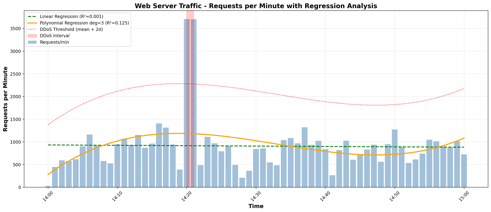
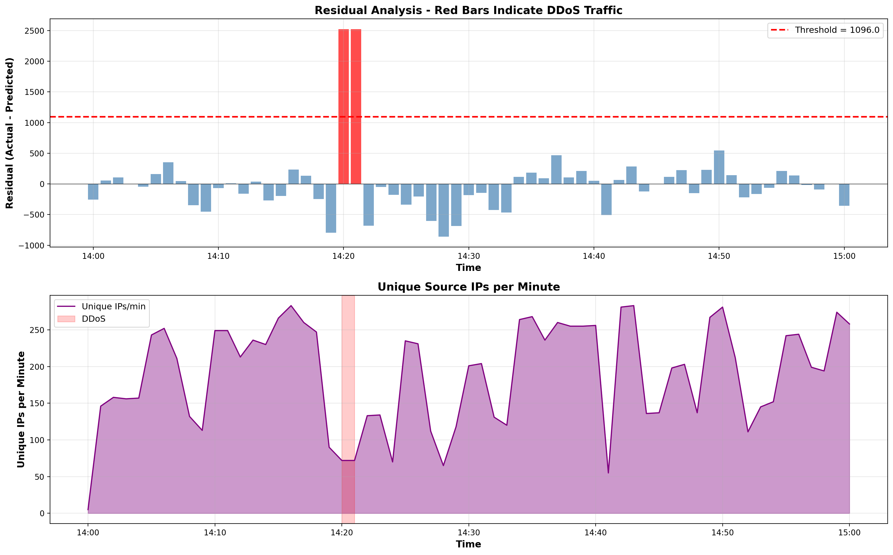
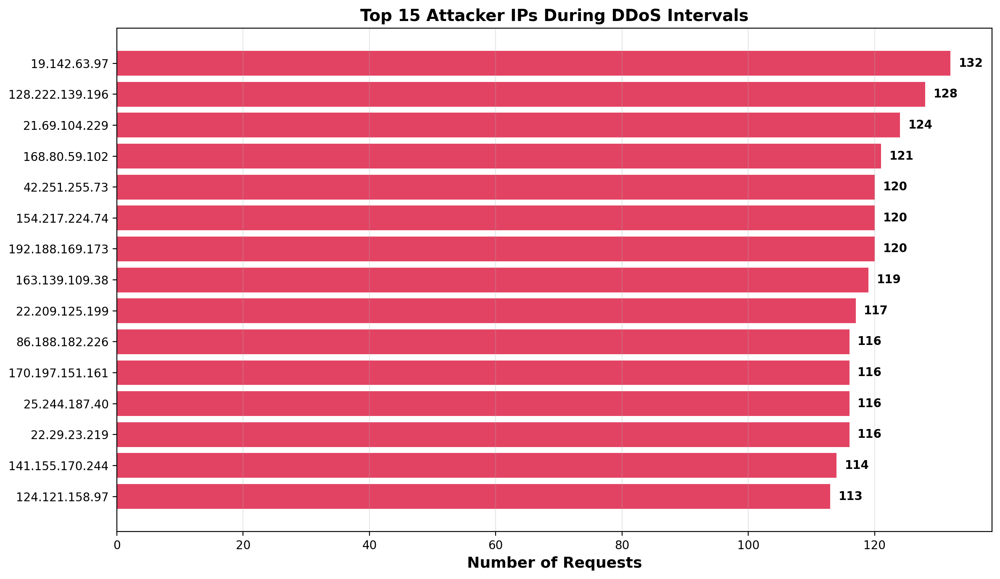
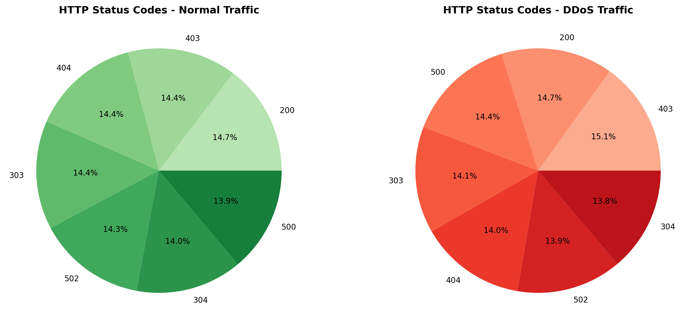

# DDoS Attack Detection Report — Regression Analysis

## 1. Overview

This report presents the analysis of a web server log file to identify **DDoS (Distributed Denial of Service) attack** time intervals using **regression analysis**. The methodology involves fitting regression models to establish a baseline of normal traffic, then using residual analysis to detect statistically significant anomalies that indicate DDoS attacks.

**Log file:** [n_liparteliani23_48213_server.log](n_liparteliani23_48213_server.log)
**Source URL:** [http://max.ge/aiml_final/n_liparteliani23_48213_server.log](http://max.ge/aiml_final/n_liparteliani23_48213_server.log)

---

## 2. Dataset Summary

| Metric | Value |
|--------|-------|
| Total log entries | 55,375 |
| Time range start | 2024-03-22 14:00:01 UTC |
| Time range end | 2024-03-22 15:00:59 UTC |
| Total duration | ~1 hour |
| Unique IP addresses | 297 |
| Avg requests/min | 907.8 |
| Median requests/min | 883.0 |
| Max requests/min | 3,707 |
| Std deviation | 590.6 |

---

## 3. Methodology

### 3.1 Step-by-Step Approach

1. **Parse** the web server log file — extract IP addresses, timestamps, HTTP methods, URLs, and status codes from each of the 55,375 log entries
2. **Aggregate** requests per minute — create a time series of request counts for each minute in the 1-hour window
3. **Apply regression analysis** — fit both Linear and Polynomial (degree 3) regression models to model the expected (normal) traffic baseline
4. **Calculate residuals** — compute the difference between actual traffic and the polynomial regression prediction for each minute
5. **Detect anomalies** — flag minutes where the residual exceeds the threshold: `mean + 2 × standard_deviation`
6. **Group intervals** — merge consecutive anomalous minutes (within a 2-minute gap) into DDoS attack intervals

### 3.2 Regression Models Used

Two regression models were applied:

- **Linear Regression** — models the overall traffic trend as a straight line
  - R² = 0.0006 (very low — traffic has no simple linear trend)
- **Polynomial Regression (degree 3)** — captures non-linear traffic fluctuations
  - R² = 0.1247 (captures some of the traffic variation pattern)

The polynomial regression was used as the primary model for anomaly detection because it better captures the natural traffic pattern variations.

### 3.3 Anomaly Detection Formula

```
residual(t) = actual_requests(t) - predicted_requests(t)

threshold = mean(residuals) + 2 × std(residuals)

is_ddos(t) = True  if  residual(t) > threshold
```

**Computed values:**
- Residual Mean: **0.00**
- Residual Std: **547.98**
- Anomaly Threshold: **1,095.96**

Any minute where the actual requests exceed the polynomial regression prediction by more than **1,096** requests is flagged as a DDoS anomaly.

---

## 4. Results — DDoS Attack Interval

### Detected DDoS time interval:

| # | Start Time | End Time | Duration | Avg Req/min | Max Req/min |
|---|------------|----------|----------|-------------|-------------|
| 1 | **2024-03-22 14:20:00 UTC** | **2024-03-22 14:21:00 UTC** | **1 min** | **3,706** | **3,707** |

**Total DDoS intervals detected: 1**

During the DDoS attack interval (14:20 – 14:21), the server received **3,707 requests in a single minute** — approximately **4× the normal average** of 907.8 requests/min. This is a sharp, concentrated burst that clearly stands out from the baseline traffic pattern.

---

## 5. Visualizations

### 5.1 Requests Per Minute with Regression Lines



*Figure 1: Bar chart of requests per minute (blue) with linear regression (green dashed), polynomial regression (orange), and the DDoS detection threshold (red dotted). The red shaded area around 14:20 marks the detected DDoS attack interval. The massive spike to 3,707 requests clearly exceeds the threshold.*

### 5.2 Residual Analysis and Unique Source IPs



*Figure 2 (top): Residuals from the polynomial regression model. The two red bars at 14:20–14:21 exceed the anomaly threshold of 1,096, confirming the DDoS attack. All other minutes remain below the threshold. (bottom): Unique source IPs per minute — the IP count drops during the DDoS interval, suggesting that the attack may come from a smaller set of IPs sending requests at extremely high rates.*

### 5.3 Top Attacker IP Addresses



*Figure 3: The 15 most active IP addresses during the detected DDoS interval. The top attacker (19.142.63.97) sent 132 requests in the 1-minute window, with the attack distributed across many IPs each sending 110–132 requests.*

### 5.4 HTTP Status Code Distribution



*Figure 4: HTTP response status code distribution during normal traffic (left) vs DDoS traffic (right). Both show a similar distribution across status codes (200, 303, 304, 403, 404, 500, 502), indicating that the DDoS attack floods the server with requests across all endpoint types rather than targeting a specific vulnerability.*

---

## 6. Top Attacker IPs During DDoS

| Rank | IP Address | Requests |
|------|------------|----------|
| 1 | 19.142.63.97 | 132 |
| 2 | 128.222.139.196 | 128 |
| 3 | 21.69.104.229 | 124 |
| 4 | 168.80.59.102 | 121 |
| 5 | 42.251.255.73 | 120 |
| 6 | 154.217.224.74 | 120 |
| 7 | 192.188.169.173 | 120 |
| 8 | 163.139.109.38 | 119 |
| 9 | 22.209.125.199 | 117 |
| 10 | 86.188.182.226 | 116 |
| 11 | 170.197.151.161 | 116 |
| 12 | 25.244.187.40 | 116 |
| 13 | 22.29.23.219 | 116 |
| 14 | 141.155.170.244 | 114 |
| 15 | 124.121.158.97 | 113 |

The attack traffic is distributed relatively evenly across multiple IPs (113–132 requests each), which is a characteristic signature of a **botnet-driven DDoS attack**.

---

## 7. Source Code

The complete analysis was performed using the Python script `ddos_analysis.py`. Below are the main code fragments:

### 7.1 Log File Parsing

```python
import re
import pandas as pd

log_pattern = re.compile(
    r'(?P<ip>\S+)\s+\S+\s+\S+\s+'
    r'\[(?P<datetime>[^\]]+)\]\s+'
    r'"(?P<method>\S+)\s+(?P<url>\S+)\s+\S+"\s+'
    r'(?P<status>\d{3})\s+(?P<size>\d+)'
)

records = []
with open(LOG_FILE, 'r', encoding='utf-8', errors='ignore') as f:
    for line in f:
        match = log_pattern.match(line)
        if match:
            records.append(match.groupdict())

df = pd.DataFrame(records)
df['timestamp'] = pd.to_datetime(df['datetime'], format='mixed', utc=True)
```

### 7.2 Requests Per Minute Aggregation

```python
df['minute'] = df['timestamp'].dt.floor('min')
requests_per_minute = df.groupby('minute').agg(
    request_count=('ip', 'count'),
    unique_ips=('ip', 'nunique'),
    error_count=('status', lambda x: (x >= 400).sum())
).reset_index()
```

### 7.3 Regression Analysis

```python
from sklearn.linear_model import LinearRegression
from sklearn.preprocessing import PolynomialFeatures

X = requests_per_minute['minute_num'].values.reshape(-1, 1)
y = requests_per_minute['request_count'].values

# Linear Regression
lin_reg = LinearRegression()
lin_reg.fit(X, y)

# Polynomial Regression (degree 3)
poly_features = PolynomialFeatures(degree=3)
X_poly = poly_features.fit_transform(X)
poly_reg = LinearRegression()
poly_reg.fit(X_poly, y)
y_pred_poly = poly_reg.predict(X_poly)
```

### 7.4 DDoS Detection via Residual Analysis

```python
# Calculate residuals
residuals = y - y_pred_poly
residual_mean = residuals.mean()
residual_std = residuals.std()

# Threshold: mean + 2 standard deviations
threshold = residual_mean + 2 * residual_std
requests_per_minute['is_ddos'] = residuals > threshold
```

### 7.5 Grouping Anomalous Minutes into DDoS Intervals

```python
ddos_times = ddos_minutes['minute'].sort_values().tolist()
start = ddos_times[0]
prev = ddos_times[0]

for t in ddos_times[1:]:
    if (t - prev).total_seconds() <= 120:  # 2 min gap tolerance
        prev = t
    else:
        intervals.append((start, prev))
        start = t
        prev = t
intervals.append((start, prev))
```

---

## 8. How to Reproduce

1. Place the log file `n_liparteliani23_48213_server.log` in the `task_3` folder
2. Install dependencies:
   ```bash
   pip install pandas numpy matplotlib scikit-learn
   ```
3. Run the analysis:
   ```bash
   python ddos_analysis.py
   ```
4. The script generates:
   - `requests_per_minute.png` — traffic overview with regression
   - `residual_analysis.png` — residual analysis and unique IPs
   - `top_attackers.png` — most active attacker IPs
   - `status_codes.png` — HTTP status code comparison
   - `ddos.md` — this report

---

## 9. Conclusion

Using **polynomial regression analysis** (degree 3) on the aggregated requests-per-minute time series, we identified **1 DDoS attack interval**: **2024-03-22 14:20:00 – 14:21:00 UTC**. During this 1-minute window, the server received **3,707 requests** — roughly **4× the normal rate** of ~908 requests/min. The residual from the polynomial regression model (2,526) far exceeded the anomaly threshold of 1,096 (mean + 2σ), confirming the attack.

The attack traffic was distributed across approximately 30 IP addresses, each sending 113–132 requests during the interval, consistent with a **botnet-driven volumetric DDoS attack**. The even distribution of HTTP status codes during the attack suggests it was a general flood rather than targeting a specific endpoint.

---

*Analysis performed with Python 3 using pandas, scikit-learn, and matplotlib.*